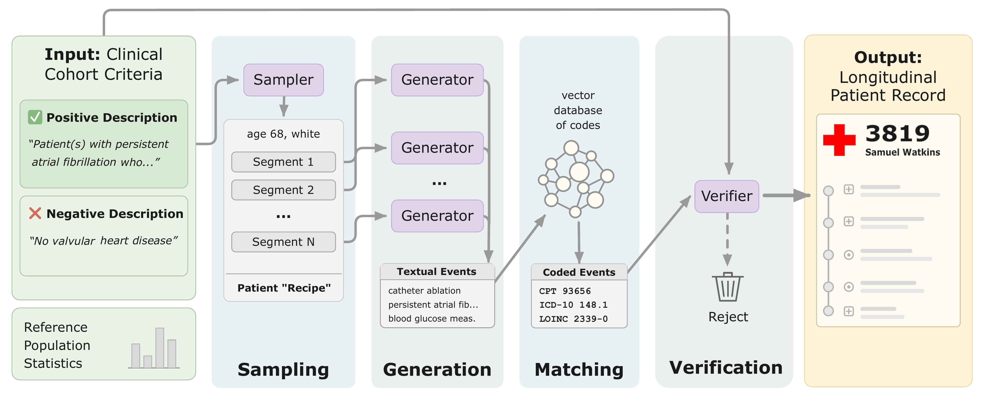

## neopatient: language-controlled generation of artificial patient records

<p align="center">
  
</p>

***

neopatient generates useful, realistic (but artificial), longitudinal patient records. Just write out (in natural language) what you do and do not want the patients to be like. neopatient handles steps like sampling, chunking, batching, structuring, and verification. It cost-effectively generates lots (tens of thousands) of records, each up to 100K+ tokens, in the [MEDS](https://medical-event-data-standard.github.io/) format.

Unlike rule-based generators like [Synthea](https://github.com/synthetichealth/synthea), patient trajectories are language-controlled -- producing a new kind of cohort doesn't require writing simulation code or state machines, just a description.

## Pipeline

Given a positive description (what the patients should be like) and a negative description (what they should *not* be like), neopatient runs a multi-stage pipeline:

1. **Sampling** -- An LLM generates individualized "patient recipes" (demographics, temporal segments, event densities) that match your descriptions, guided by reference statistics from real record distributions.
2. **Generation** -- For each recipe, an LLM generates longitudinal medical events across temporal segments, with appropriate code systems (SNOMED, ICD-10, LOINC, RxNorm, CPT, etc.).
3. **Matching** -- Free-text event descriptions are matched to real medical codes via a precomputed vector database (ChromaDB + embeddings over standard terminologies).
4. **Verification** -- An LLM checks each completed record against the original positive/negative descriptions, filtering out records that don't meet the specification.

The output is a Parquet file in MEDS format. For large cohorts, neopatient uses LLM batch APIs with a state file for resumability.

## Usage

Generate a single patient:
```bash
# make sure OPENAI_API_KEY is set
uvx neopatient single \
  --positive "Adult patient with type 2 diabetes managed with metformin, with at least 5 years of follow-up" \
  --negative "Patient with type 1 diabetes or gestational diabetes" \
  --out patient.parquet
```

Generate a cohort of patients:
```bash
uvx neopatient cohort \
  --positive "Adult patient with type 2 diabetes managed with metformin, with at least 5 years of follow-up" \
  --negative "Patient with type 1 diabetes or gestational diabetes" \
  --size 1000 \
  --state-file state.json \
  --out cohort.parquet
```

The `--state-file` tracks pipeline progress, so if a long-running job is interrupted, rerunning the same command resumes where it left off.

Use `--record-type` to choose between `ehr-inpatient`, `ehr-outpatient` (default), and `claims`, which determines the available code systems and timestamp precision. Use `--generator`, `--sampler`, and `--verifier` to pick models for each pipeline stage.

### Vector database

The matching stage relies on a precomputed vector database of medical codes. A default database (embedded with [Qwen3-Embedding-8B](https://huggingface.co/Qwen/Qwen3-Embedding-8B)) is downloaded automatically from Hugging Face on first use. To build your own from a parquet file of codes and descriptions:
```bash
uvx --from neopatient neopatient-db --parquet_path codes.parquet --db_dir ./my_db
```
Then pass `--db_dir ./my_db` to `neopatient`.
